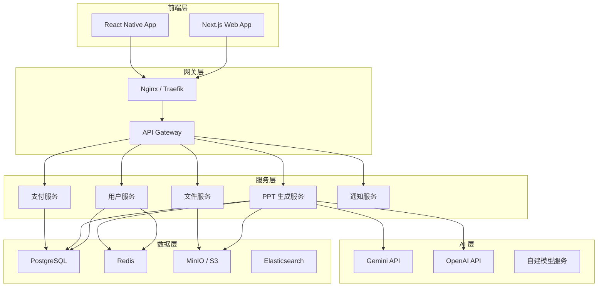

# Super Banana Slides 商业版本实施方案

## 一、项目定位

### 1.1 目标用户
- **主要用户**：无技术背景的普通用户（学生、职场人士、教师等）
- **次要用户**：需要快速制作 PPT 的专业人士
- **企业用户**：需要批量生成演示文稿的团队

### 1.2 核心价值主张
- **零门槛**：无需安装，打开浏览器即可使用
- **高质量**：基于先进 AI 模型，生成专业级 PPT
- **高效率**：3 分钟内完成一份完整 PPT
- **灵活性**：支持多种创作方式和自定义需求

---

## 二、功能规划

### 2.1 核心功能（MVP）

#### 用户系统
- **注册/登录**
  - 邮箱注册（带验证）
  - 第三方登录（微信、Google、GitHub）
  - 手机号注册（可选）
- **用户中心**
  - 个人信息管理
  - 配额查看
  - 使用历史
  - 账单记录

#### 配额系统
- **配额类型**
  - 免费配额：新用户赠送 3 次生成机会
  - 付费配额：按次购买或订阅制
  - 企业配额：团队共享配额池
- **消耗规则**
  - 生成大纲：免费
  - 生成单页描述：0.1 次
  - 生成单页图片：1 次
  - 编辑图片：0.5 次
  - 导出 PPTX：0.2 次
  - 导出可编辑 PPTX：0.5 次

#### PPT 生成功能
- **简化创作流程**
  - 一键生成：输入主题 → 自动生成完整 PPT
  - 快速编辑：拖拽式编辑器，所见即所得
  - 智能推荐：根据主题推荐模板和风格
- **保留核心能力**
  - 三种创作路径（想法/大纲/描述）
  - 自然语言编辑
  - 素材上传和解析
  - 多格式导出

#### 支付系统
- **支付方式**
  - 国内：支付宝、微信支付
  - 国际：Stripe、PayPal
- **定价策略**
  - 按次付费：¥2/次（10 次起购）
  - 月度订阅：¥29/月（50 次）
  - 年度订阅：¥199/年（800 次）
  - 企业套餐：定制化

### 2.2 进阶功能（V2）

#### 模板市场
- 官方模板库（100+ 精选模板）
- 用户上传模板（审核后上架）
- 付费模板（设计师分成）

#### 团队协作
- 团队空间
- 成员权限管理
- 项目共享和评论
- 版本历史和回退

#### API 开放平台
- RESTful API
- SDK（Python、JavaScript、Java）
- Webhook 通知
- 开发者文档

### 2.3 高级功能（V3）

#### AI 增强
- 智能配色建议
- 内容优化建议
- 演讲稿生成
- 语音转 PPT

#### 数据分析
- 使用统计
- 热门主题分析
- 用户行为分析
- A/B 测试

---

## 三、技术架构

### 3.1 整体架构



### 3.2 技术选型

#### 前端
- **框架**：Next.js 14（App Router）
  - 理由：SSR/SSG 支持，SEO 友好，性能优秀
- **UI 库**：Shadcn/ui + Tailwind CSS
  - 理由：现代化设计，高度可定制
- **状态管理**：Zustand + React Query
  - 理由：轻量级，易于使用
- **编辑器**：自研拖拽编辑器（基于 Fabric.js）
  - 理由：更好的控制和定制能力

#### 后端
- **框架**：FastAPI（Python 3.11+）
  - 理由：高性能，异步支持，自动文档生成
- **数据库**：PostgreSQL 15+
  - 理由：成熟稳定，支持 JSON，强大的查询能力
- **缓存**：Redis 7+
  - 理由：高性能，支持多种数据结构
- **消息队列**：Celery + RabbitMQ
  - 理由：成熟的异步任务方案
- **对象存储**：MinIO（自建）或 AWS S3
  - 理由：成本可控，兼容 S3 API

#### AI 服务
- **主力模型**：Google Gemini Pro
- **备用模型**：OpenAI GPT-4、Claude
- **图像生成**：Gemini Imagen、DALL-E 3
- **OCR**：百度 OCR、Tesseract

#### DevOps
- **容器化**：Docker + Docker Compose
- **编排**：Kubernetes（生产环境）
- **CI/CD**：GitHub Actions
- **监控**：Prometheus + Grafana
- **日志**：ELK Stack

### 3.3 数据库设计

#### 核心表结构

```sql
-- 用户表
CREATE TABLE users (
    id UUID PRIMARY KEY DEFAULT gen_random_uuid(),
    email VARCHAR(255) UNIQUE NOT NULL,
    password_hash VARCHAR(255),
    username VARCHAR(100),
    avatar_url TEXT,
    quota_balance INTEGER DEFAULT 0,
    role VARCHAR(20) DEFAULT 'user',
    is_verified BOOLEAN DEFAULT FALSE,
    created_at TIMESTAMP DEFAULT NOW(),
    updated_at TIMESTAMP DEFAULT NOW()
);

-- 配额记录表
CREATE TABLE quota_transactions (
    id UUID PRIMARY KEY DEFAULT gen_random_uuid(),
    user_id UUID REFERENCES users(id),
    amount INTEGER NOT NULL,
    type VARCHAR(20) NOT NULL, -- 'purchase', 'consume', 'refund', 'gift'
    description TEXT,
    order_id UUID,
    created_at TIMESTAMP DEFAULT NOW()
);

-- 订单表
CREATE TABLE orders (
    id UUID PRIMARY KEY DEFAULT gen_random_uuid(),
    user_id UUID REFERENCES users(id),
    amount DECIMAL(10, 2) NOT NULL,
    quota_amount INTEGER NOT NULL,
    status VARCHAR(20) DEFAULT 'pending',
    payment_method VARCHAR(50),
    payment_id TEXT,
    created_at TIMESTAMP DEFAULT NOW(),
    paid_at TIMESTAMP
);

-- 项目表（重写版）
CREATE TABLE projects (
    id UUID PRIMARY KEY DEFAULT gen_random_uuid(),
    user_id UUID REFERENCES users(id),
    title VARCHAR(255) NOT NULL,
    description TEXT,
    creation_type VARCHAR(20),
    template_id UUID,
    style_config JSONB,
    status VARCHAR(20) DEFAULT 'draft',
    is_public BOOLEAN DEFAULT FALSE,
    view_count INTEGER DEFAULT 0,
    created_at TIMESTAMP DEFAULT NOW(),
    updated_at TIMESTAMP DEFAULT NOW()
);

-- 页面表（重写版）
CREATE TABLE pages (
    id UUID PRIMARY KEY DEFAULT gen_random_uuid(),
    project_id UUID REFERENCES projects(id) ON DELETE CASCADE,
    order_index INTEGER NOT NULL,
    title VARCHAR(255),
    content JSONB,
    image_url TEXT,
    thumbnail_url TEXT,
    created_at TIMESTAMP DEFAULT NOW(),
    updated_at TIMESTAMP DEFAULT NOW()
);

-- 模板表
CREATE TABLE templates (
    id UUID PRIMARY KEY DEFAULT gen_random_uuid(),
    name VARCHAR(255) NOT NULL,
    description TEXT,
    preview_url TEXT,
    category VARCHAR(50),
    tags TEXT[],
    is_premium BOOLEAN DEFAULT FALSE,
    price DECIMAL(10, 2),
    author_id UUID REFERENCES users(id),
    download_count INTEGER DEFAULT 0,
    created_at TIMESTAMP DEFAULT NOW()
);
```

---

## 四、与 banana-slides 的差异化

### 4.1 学习借鉴的部分
- ✅ Prompt 工程思路
- ✅ 三种创作路径的设计理念
- ✅ 可编辑 PPTX 导出的技术思路
- ✅ 文件解析的方法

### 4.2 完全重写的部分
- 🔄 前端框架（React → Next.js）
- 🔄 后端框架（Flask → FastAPI）
- 🔄 数据库（SQLite → PostgreSQL）
- 🔄 状态管理（Zustand 重新实现）
- 🔄 UI 设计（全新设计系统）
- 🔄 代码结构（完全不同的组织方式）

### 4.3 新增的商业化功能
- ➕ 用户系统（注册、登录、认证）
- ➕ 配额系统（购买、消耗、追踪）
- ➕ 支付集成（支付宝、微信、Stripe）
- ➕ 订阅管理（月度、年度订阅）
- ➕ 团队协作（多人协作、权限管理）
- ➕ 模板市场（模板上传、购买）
- ➕ API 平台（开放 API、SDK）
- ➕ 数据分析（用户行为、使用统计）

---

## 五、开发路线图

### Phase 1: 基础设施（2-3 周）
- Week 1: 项目初始化、用户系统、认证
- Week 2: 配额系统、支付集成
- Week 3: 基础 UI 框架、项目管理

### Phase 2: 核心功能（4-6 周）
- Week 4-5: PPT 生成引擎重写
- Week 6-7: 编辑器开发
- Week 8-9: 导出功能、文件解析

### Phase 3: 优化与测试（2-3 周）
- Week 10: 性能优化、Bug 修复
- Week 11: 用户测试、反馈迭代
- Week 12: 安全审计、压力测试

### Phase 4: 上线准备（1-2 周）
- Week 13: 部署配置、监控设置
- Week 14: 软启动、灰度发布

---

## 六、成本估算

### 6.1 开发成本
- 前端开发：2 人 × 3 个月 = 6 人月
- 后端开发：2 人 × 3 个月 = 6 人月
- UI/UX 设计：1 人 × 2 个月 = 2 人月
- 测试：1 人 × 1 个月 = 1 人月
- **总计**：15 人月

### 6.2 运营成本（月度）
- 云服务器：¥2,000/月（初期）
- AI API 调用：¥5,000/月（按使用量）
- CDN 流量：¥1,000/月
- 对象存储：¥500/月
- 其他服务：¥500/月
- **总计**：¥9,000/月

### 6.3 营销成本
- SEO 优化：¥10,000（一次性）
- 内容营销：¥5,000/月
- 广告投放：¥10,000/月（可选）

---

## 七、风险控制

### 7.1 技术风险
- **AI API 稳定性**：准备多个备用 API，实现自动切换
- **性能瓶颈**：使用缓存、CDN、负载均衡
- **数据安全**：加密存储、定期备份、权限控制

### 7.2 法律风险
- **版权问题**：完全重写代码，避免直接复制
- **用户协议**：明确服务条款、隐私政策
- **支付合规**：使用正规支付渠道，遵守金融法规

### 7.3 商业风险
- **市场竞争**：差异化定位，强调用户体验
- **用户获取**：多渠道推广，口碑营销
- **盈利模式**：灵活定价，提供免费试用

---

## 八、下一步行动

1. **立即执行**
   - [ ] 创建 `commercial` 分支
   - [ ] 配置新的 Git 仓库
   - [ ] 编写闭源版本 README

2. **本周完成**
   - [ ] 详细的 API 设计文档
   - [ ] 数据库 Schema 设计
   - [ ] 前端原型设计（Figma）

3. **下周启动**
   - [ ] 用户系统开发
   - [ ] 支付系统集成
   - [ ] 基础 UI 框架搭建

---

## 九、总结

Super Banana Slides 将是一个完全独立的商业产品，虽然借鉴了 banana-slides 的成功经验，但在代码实现、技术架构、功能设计上都将完全重写。我们的目标是打造一个**零门槛、高质量、易用性强**的 AI PPT 生成 SaaS 平台，为普通用户提供专业级的 PPT 制作能力。

通过渐进式开发和持续迭代，我们将在 3-4 个月内完成 MVP 版本，并在 6 个月内实现盈利。
